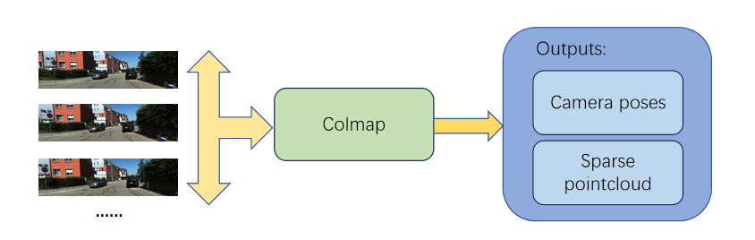
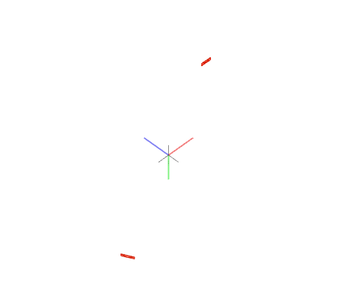
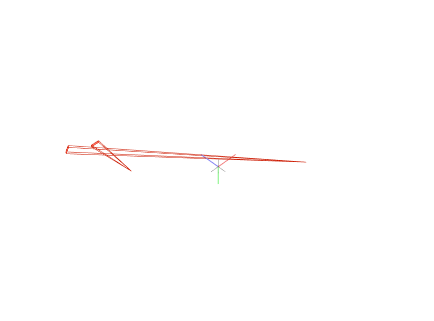
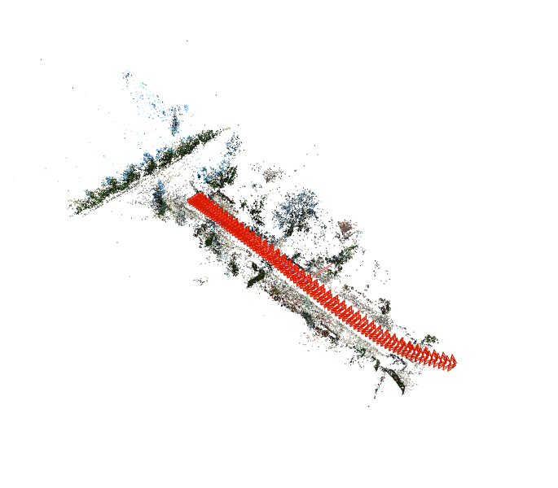
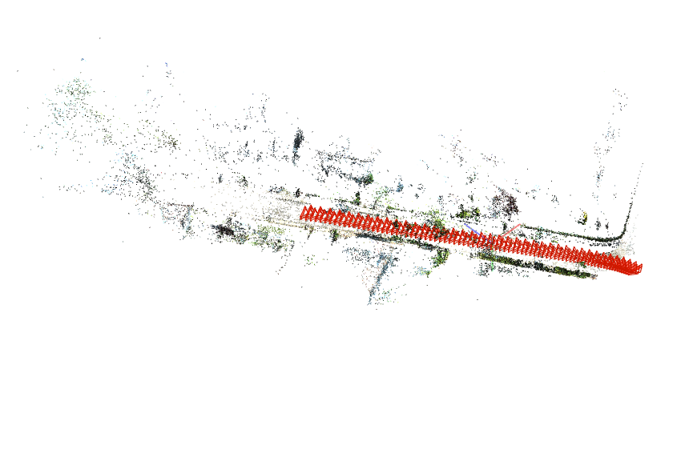
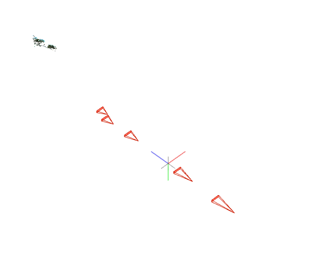

# ICIP2025_rebuttal

We provide the the sample reconstruction results of COLMAP on the KITTI-360 dataset.  
Without any additional preprocessing or parameter tuning, COLMAP failed to produce valid reconstructions on 3 out of the 5 scenes (Seq 1, Seq 2, and Seq 5).

The pipeline of using colmap is illustrated as following:

---

### Seq 1 (Failed Reconstruction)

---

### Seq 2 (Failed Reconstruction)

---

### Seq 3 (Successful Reconstruction)

---

### Seq 4 (Successful Reconstruction)

---

### Seq 5 (Failed Reconstruction)

